<div align=center>

# Oma K-ron


This project aims to develop a website for the Oma K-ron company to help them have an online presence and promote their business.

Oma K-ron is a bakery company specializing in baking macarons. They sell macarons and wedding cakes and they offer baking courses. Macarons are small cakes that can be offered as presents, enjoyed for special events, or even appreciated at any time.

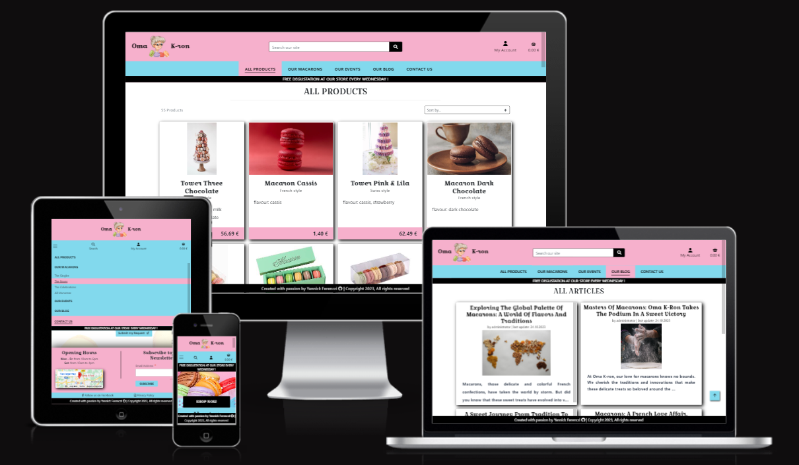

**- by Yannick Ferenczi -**

**[Live site](https://oma-k-ron-0db832a08dd8.herokuapp.com/) | [Repository](https://github.com/yannickferenczi/oma-k-ron-website)**

-- built with --
<p style="background-color: white; padding: 5px; display: inline-block; margin: 0 auto;">


</p>

</div>

---

<div align="center">

## 1. Table of Content

</div>

- [1. Table of Content](#1-table-of-content)
- [2. Business Model](#2-business-model)
  - [2.1. Business Overview](#21-business-overview)
- [3. UX Design](#3-ux-design)
  - [3.1. Strategy Plane](#31-strategy-plane)
    - [3.1.1. Goals and objectives](#311-goals-and-objectives)
    - [3.1.2. Target Audience](#312-target-audience)
  - [3.2. Scope Plane](#32-scope-plane)
    - [3.2.1. Define Must-Have Features](#321-define-must-have-features)
    - [3.2.2. Define Information to provide (content requirements)](#322-define-information-to-provide-content-requirements)
  - [3.3. Structure Plane](#33-structure-plane)
    - [3.3.1. Interaction Design (IXD)](#331-interaction-design-ixd)
      - [3.3.1.1. Define Pages](#3311-define-pages)
      - [3.3.1.2. Handle errors](#3312-handle-errors)
    - [3.3.2. Information Architecture (IA)](#332-information-architecture-ia)
  - [3.4. Skeleton Plane](#34-skeleton-plane)
    - [3.4.1. Wireframes](#341-wireframes)
  - [3.5. Surface Plane](#35-surface-plane)
    - [3.5.1. Color Palette](#351-color-palette)
    - [3.5.2. Font Choices](#352-font-choices)
  - [3.6. Database Schema](#36-database-schema)
- [4. Agile Development](#4-agile-development)
  - [4.1. The workflow](#41-the-workflow)
  - [4.2. Labels](#42-labels)
  - [4.3. The views of the project manager](#43-the-views-of-the-project-manager)
  - [4.4. The story points](#44-the-story-points)
  - [4.5. The sprints](#45-the-sprints)
- [5. Marketing Strategy](#5-marketing-strategy)
  - [5.1. SEO Project planning](#51-seo-project-planning)
    - [5.1.1. Keywords](#511-keywords)
    - [5.1.2. sitemap.xml and robots.txt files](#512-sitemapxml-and-robotstxt-files)
  - [5.2. Content Marketing](#52-content-marketing)
  - [5.3. Social Media Marketing](#53-social-media-marketing)
  - [5.4. Email Marketing](#54-email-marketing)
- [6. Features](#6-features)
  - [6.1. Features currently available](#61-features-currently-available)
  - [6.2. More features to implement](#62-more-features-to-implement)
- [7. Technology Used](#7-technology-used)
- [8. Testing](#8-testing)
- [9. References and Credits](#9-references-and-credits)
- [10. Procedures](#10-procedures)
  - [10.1. Project Creation](#101-project-creation)
    - [10.1.1. Create PostgreSQL database using ElephantSQL](#1011-create-postgresql-database-using-elephantsql)
  - [10.2. Local Development](#102-local-development)
  - [10.3. Hosting images and static file with AWS](#103-hosting-images-and-static-file-with-aws)
  - [10.4. Add Stripe to the project](#104-add-stripe-to-the-project)
  - [10.5. Deployment to Heroku](#105-deployment-to-heroku)
- [11. Acknowledgement](#11-acknowledgement)

---

<div align="center">

## 2. Business Model

</div>

### 2.1. Business Overview

The business is a B2C e-commerce platform whose goal is to sell the best macarons in Germany. They also offer baking courses. Having a website can help them reach more customers and promote their products.

[Back to the Table of Content](#1-table-of-content)

---

<div align="center">

## 3. UX Design

</div>

### 3.1. Strategy Plane

#### 3.1.1. Goals and objectives

Objectives for the website are:

- An easy-to-navigate website with a clear purpose
- Allow users to see the company's offers
- Allow users to purchase online

The goals for the site owner are:

- have an online presence
- promote their business
- show their offers and prices
- reduce customer solicitations by providing them with an online checkout system

The goals for the site user are:

- discover the purpose of the business
- discover the offers of the business
- easy online shopping

#### 3.1.2. Target Audience

Potential customers are people looking for a simple gift to bring to a dinner people organizing their wedding or any celebration where they would like to have an outstanding cake or people interested in learning or improving their baking skills.

### 3.2. Scope Plane

The scope of this project only focused on fulfilling the assessment criteria of Code Institute as the timeline was very tight.

It was a 4-week schedule to develop a business model, an e-commerce website with an authentication system, checkout system, notification system, product management system, full documentation, and a web marketing campaign.

Therefore, there is no plan to implement extra features within this timeline.

#### 3.2.1. Define Must-Have Features

Features that every website should implement:

- responsive navigation menu
- logo
- social media links
- error handlers
- favicon
- contact form
- a CTA

Features required for this particular project:

- Authentication system
- Purchase and checkout system
- Product management system
- Notification system
- Newsletter subscription
- SEO

#### 3.2.2. Define Information to provide (content requirements)

Users should clearly understand that the website is an online shop and that it sells Macarons.
An About section on the main page should be developed with keywords to improve search engine ranking.

### 3.3. Structure Plane

#### 3.3.1. Interaction Design (IXD)

##### 3.3.1.1. Define Pages

- landing page
- registration page
- login page
- Logout page
- product list page
- add product page
- product detail page
- edit the product page
- shopping cart page
- checkout page
- contact form
- profile page

##### 3.3.1.2. Handle errors

Error 400, 403, 404, and 500 pages are also to be implemented.

#### 3.3.2. Information Architecture (IA)

information is organized with some known patterns so that users easily find what they are looking for such as:

- navigation menu at the top
- name and logo at the top
- social media links in the footer
- company location and newsletter in the footer
- shopping cart and account icons on the right corner

### 3.4. Skeleton Plane

#### 3.4.1. Wireframes

Wireframes have been adapted during the development phase to offer a better user experience.

Landing page:
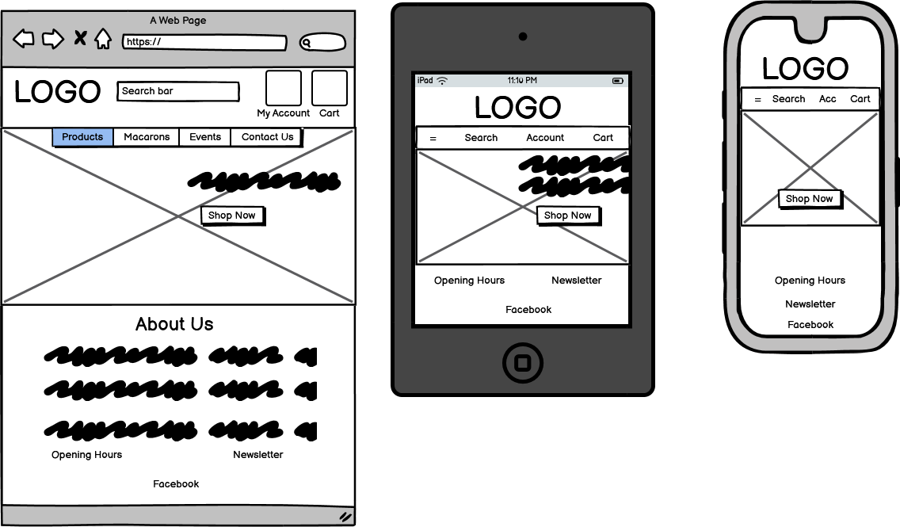

List of products page:
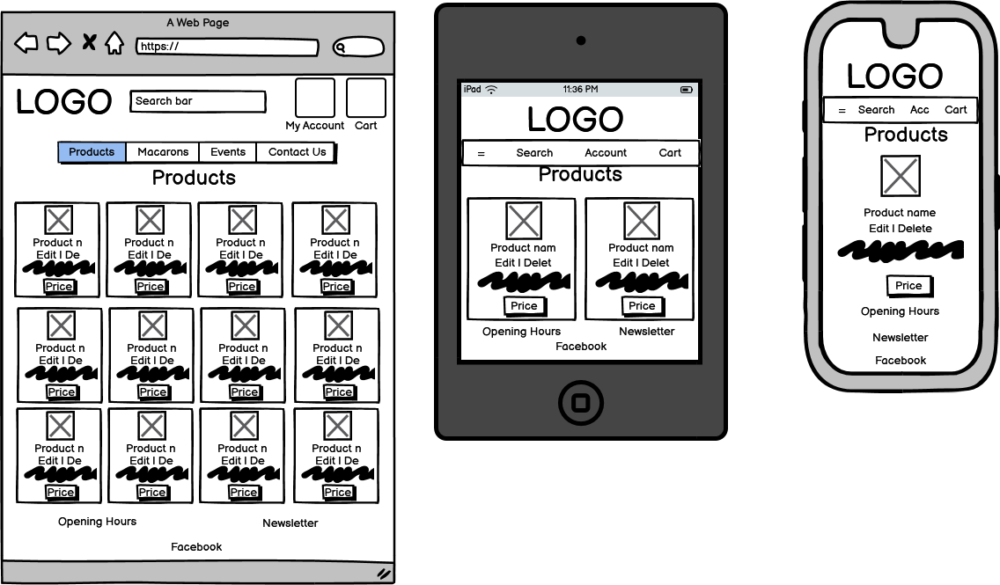

Product detail page:
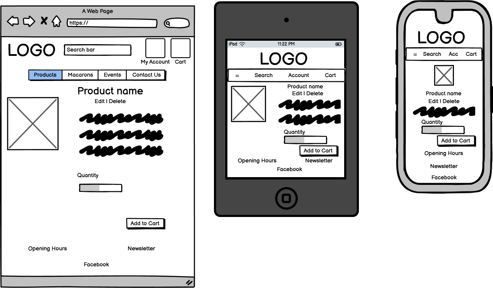

Shopping cart page:
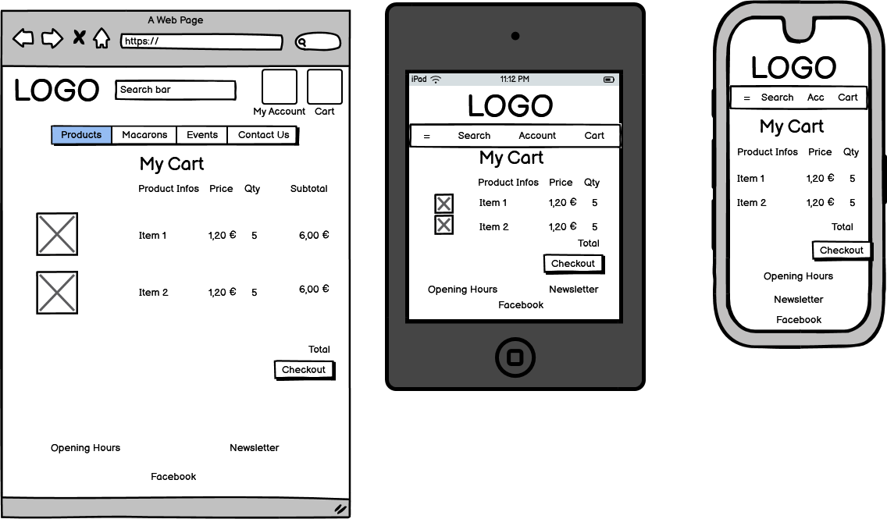

Contact form page:
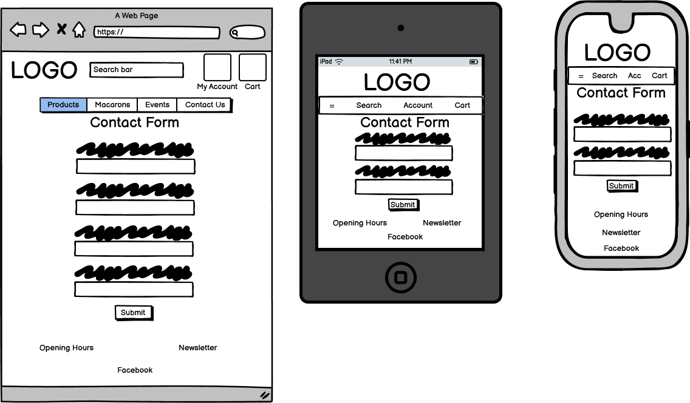

### 3.5. Surface Plane

#### 3.5.1. Color Palette

Two colors have been chosen for this project. They come from the hero image used for the landing page. It communicates a childish feeling and makes everyday life problems disappear for a moment. They also perfectly represent the colorful world of macarons.

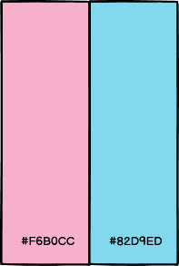

#### 3.5.2. Font Choices

The "croissant one" font has been picked for headers to give users a feeling of abundance. The font is backed up with cursive font.

### 3.6. Database Schema

The database schema has been modified during the development phase to provide a more powerful tool.

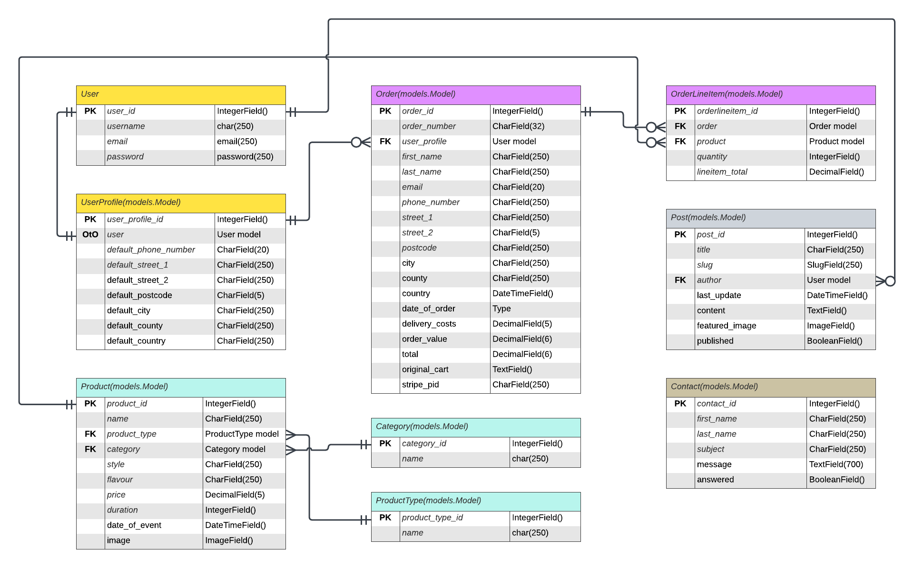

[Back to the Table of Content](#1-table-of-content)

---

<div align="center">

## 4. Agile Development

</div>

The project development has been managed with an agile project manager on GitHub. It is public [here](https://github.com/users/yannickferenczi/projects/18/views/1).

### 4.1. The workflow

The workflow of the project has been broken down into small organized pieces to help realize the amount of work and help spread it over the given period. It organizes a hierarchy as below:

<details>
    <summary>The full project (represented by the project manager)</summary>
    <p>The project manager has been a roadbook, leading the development of this project to its success, handling quite well the stress of such a challenge.</p>
</details>

<details>
    <summary>Milestones</summary>
    <p>5 Milestones were developed for this project.
    <ul>
    <li>The first Milestone [Project Preparation](https://github.com/yannickferenczi/oma-k-ron-website/milestone/1) was a guideline to prepare the project and set up the working environment.</li>
    <li>The second Milestone [Required Features](https://github.com/yannickferenczi/oma-k-ron-website/milestone/3) was there to list the minimum features to implement.</li>
    <li>The third Milestone [Required Marketing](https://github.com/yannickferenczi/oma-k-ron-website/milestone/4) was there to list the required marketing features.</li>
    <li>The fourth Milestone [Required Documentation](https://github.com/yannickferenczi/oma-k-ron-website/milestone/2) was there to list the required documentation.</li>
    <li>And finally a fifth Milestone [Extra Features](https://github.com/yannickferenczi/oma-k-ron-website/milestone/5) has been created to add some nice features to have if the time allows it.</li>
    </ul>
    </p>
</details>

<details>
    <summary>EPICS</summary>
    <p>Milestones have been broken into Epics. They correspond to important achievements for the project such as "implementing an authentication system" or "implementing a checkout system". They were there to help me concentrate on concrete things to work on while developing the project. It gave some clear direction to take, knowing that they serve the general purpose of the project.</p>
</details>

<details>
    <summary>User Stories</summary>
    <p>User stories were backlog product items that could be done in quite a short time. So they could be contained within a sprint and therefore allow every sprint to have its number of achievements. Some user stories together usually fulfill an EPIC.</p>
</details>

<details>
    <summary>Tasks</summary>
    <p>Finally, tasks were defined within the user stories to remind the stakeholders what to develop. They were there to help define the user story, giving more precise things to work on.</p>
</details>

### 4.2. Labels

Labels have been created to quickly visualize the type of backlog product item and its priority. Below is a screenshot of the labels used for the project.


### 4.3. The views of the project manager

The project manager contains 4 views. The three first have been very useful during the development. The fourth one is more of a nice overview of the efforts spread over time.

- The first view: Home

    The first view, called home, was used during the development phase with the filter `is:open`. It was the first and the last view to look at on a working day. It helped to know what needed to be done, and what needed to be prioritized and helped organize the upcoming days.

- The second view: Current sprint

    The second view was just nice to have when tasks were done and the goal of the current sprint was getting closer and closer. It gave a nice feeling of achievement while pushing the backlog product items to the "Ready" column and then to the "Deployed" column when they were respectively done and deployed to the live website.

- The third view: Sprints

    The third view was similar to the second one. Only it gave an overview of the full project and not just of the current sprint. It helped keep the deadline in mind and avoided wasting time on some "nice to have but cool to work on" features so the focus would mostly be on the right tasks.

- The fourth view: Roadmap

    The fourth view is just an overview of the three weeks of work that led to this project. It did not really bring help to the development of the project.

### 4.4. The story points

Story points have been assigned to user stories only to be able to submit the project as much developed as possible and, of course, on time. It was clear that the final product would not be done in such a short time, especially because the implementation of the payment system seemed quite tricky to me and I would have liked to dive more into it to really understand the whole mechanic. As expected, I really struggled with this part of the project implementation being stuck on this matter for a pretty long time. This is why the story points of sprints 4 and 5 are so low compared to the other sprints.

My priority was as expected to develop a minimum viable product (MVP) that corresponds to the expected project from the assessment criteria of Code Institute. To achieve this expectation in such a short time, I did not find another way than to repeat the steps of the [Boutique-Ado](https://github.com/Code-Institute-Solutions/boutique_ado_v1) walkthrough project.

### 4.5. The sprints

The project has been developed in 9 Sprints of 3 days.
Each sprint counts a certain amount of story points based on their Epics, User Stories, and tasks. They are as below:

| Sprints | Dates | Total Story Points |
| --- | :---: | :---: |
| Sprint 1 | 28/09 - 30/09 | 70 |
| Sprint 2 | 02/10 - 04/10 | 72 |
| Sprint 3 | 05/10 - 07/10 | 56 |
| Sprint 4 | 09/10 - 11/10 | 16 |
| Sprint 5 | 12/10 - 14/10 | 40 |
| Sprint 6 | 16/10 - 18/10 | 88 |
| Sprint 7 | 19/10 - 21/10 | 40 |
| Sprint 8 | 23/10 - 25/10 | 32 |
| Sprint 9 | 26/10 - 27/10 | 48 |

To conclude, I must admit that I started this project with a very high level of stress because the whole checkout and payment system was quite involved. Creating this agile project manager was definitely helpful in reminding me every day that the timeline was tight and that I should not lose focus. Nevertheless, it kept my stress at its highest level for the full implementation period and made me feel overwhelmed every single day.

[Back to the Table of Content](#1-table-of-content)

---
<div align="center">

## 5. Marketing Strategy

</div>

### 5.1. SEO Project planning

The meta description and meta keywords have been added to the base.html template to help search engines find the website as a relevant answer to users' searches.

Keywords have then been used as much as possible in HTML elements throughout the website.

Attributes rel have been set to "noopener" for social media links.

#### 5.1.1. Keywords

The first brainstorming came up with the following words:

macarons, wedding cakes, simple gift ideas for a dinner, last-minute small gifts for a dinner, sandwich cookies, smooth cookies, meringue-based cookies, luxury cookies, baking courses, bachelorette event ideas, 

From that brainstorming and the use of Wordtracker to optimize the selection of keywords the list above was reduced to below because they were the ones with the most relevance and volume:

**Short-tail keywords**

- macarons, wedding cake, baking course

**Long-tail keywords**

- small gifts for dinner party guests, bachelorette event ideas

#### 5.1.2. sitemap.xml and robots.txt files

To help search engines understand the structure of the website and optimize its ranking in their results sitemap.xml and robots.txt files have been created and added to the root directory of the project.

### 5.2. Content Marketing

A blog section has been implemented to help the owner develop new content on their website so search engines keep detecting recent activities and the amount of keywords keeps growing on the website.

### 5.3. Social Media Marketing

A Facebook Business Page has been created to help the business develop an active community and improve the traffic to their online shop.

The hero image of the landing page of their website has been used as a cover picture for their Facebook business page so users can quickly identify the business.

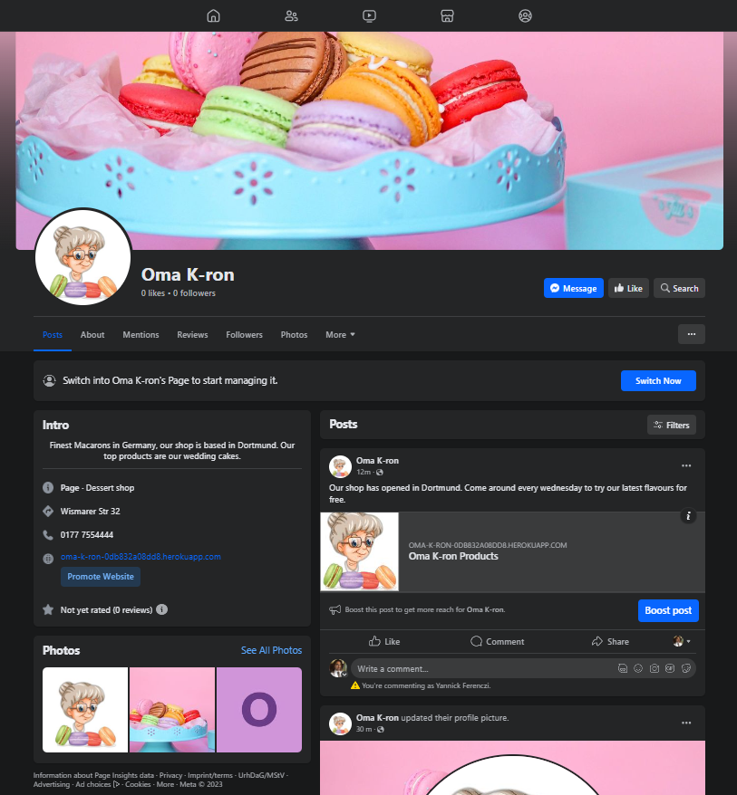

### 5.4. Email Marketing

Using MailChimp was an easy way to implement a newsletter subscritpion and therefore collect email addresses of potential customers to reach them out when creating special offers or events.

[Back to the Table of Content](#1-table-of-content)

---

<div align="center">

## 6. Features

</div>

This project is a full-stack web application using a cloud-based database (PostgreSQL) to record data and an online payment provider (Stripe) to accept payments.

### 6.1. Features currently available

- A branding with a logo, a name, and the colors of the company


- A navigation menu


- A call to action (CTA) on a hero image


- A footer with opening hours, a newsletter subscription, and links to social media


- A copyright


- A profile page


- A notification system


- An authentication system


- A shopping cart


- A checkout system


- Searching and filtering functionalities


### 6.2. More features to implement

It would be nice to have the possibility to add a discount code within the checkout process so customers who have already purchased something are more likely to purchase again if they can benefit from a discount.

It would also be nice to have a "click and collect" option. I actually wanted to implement this feature at first and I wasted a lot of time troubleshooting the checkout process so I have decided to give up on that feature as it was not a must-have for the assessment criteria.

[Back to the Table of Content](#1-table-of-content)

---

<div align="center">

## 7. Technology Used

</div>

- Languages, Databases, Frameworks and libraries:

  - HTML5
  - CSS3
  - Javascript
  - Bootstrap 4.6.2
  - boto3 1.28.64
  - Python 3.9.17
  - Django 3.2.21
  - django-allauth 0.41.0
  - django-countries 7.5.1
  - django-crispy-forms 1.14.0
  - django-storages 1.14.2
  - django-summernote 0.8.20.0
  - dj-database-url 2.1.0
  - gunicorn 20.0.4
  - Pillow 10.0.1
  - PostgreSQL
  - psycopg2-binary 2.9.8
  - stripe 2.42.0
  - Markdown

- Other tools:

  - [Git](https://git-scm.com/) has been used for version control
  - [GitHub](https://github.com/) has been used to store the project code
  - [Code Anywhere](https://codeanywhere.com/) has been used as cloud ide
  - [Google Fonts](https://fonts.google.com/) has been used for the fonts
  - [Font Awesome](https://fontawesome.com/) has been used for the icons
  - [Pexels](https://www.pexels.com/) has been used to find free pictures
  - [Tiny PNG](https://tinypng.com/) has been used to further optimize the images for the site and reduce the file size
  - [ElephantSQL](https://customer.elephantsql.com/) has been used to store the database
  - [Heroku](https://www.heroku.com/) has been used to deploy the live website
  - [Google Chrome Dev Tools](https://developers.google.com/web/tools/chrome-devtools) has been used to inspect page elements, debug issues with the site & test responsiveness on different mockup devices.
  - [Markup Validation Service](https://validator.w3.org/) has been used to check the HTML code
  - [CSS Validation Service](https://jigsaw.w3.org/css-validator/) has been used to check the CSS code
  - [CI Python Linter](https://pep8ci.herokuapp.com/) has been used to check the Python code
  - [JSHint](https://jshint.com/) has been used to check the Javascript code
  - [PageSpeed Insights](https://pagespeed.web.dev/) has been used to check the speed of the website
  - [Wave](https://wave.webaim.org/) has been used to test the accessibility of the website
  - [Accessibility Checker](https://www.accessibilitychecker.org/) has been used to test the accessibility of the website
  - [Am I responsive](https://ui.dev/amiresponsive) has been used to create a mockup of responsiveness
  - [Shields.io](https://shields.io/) has been used to create badges within the README.md file
  - [Mailchimp](https://mailchimp.com/) has been used to collect emails from potential customers
  - [Wordtracker](https://www.wordtracker.com/) has been used to improve keywords for the SEO

[Back to the Table of Content](#1-table-of-content)

---

<div align="center">

## 8. Testing

</div>

Testing details can be found separately in the [TESTING.md](TESTING.md) file

---

<div align="center">

## 9. References and Credits

</div>

It was a very challenging project because of its scope, its very advanced features, and its timeline. Therefore I did not want to risk myself following unknown paths to deeply experiment with the Django framework like I did in my last project. It was less fun but the priority was definitely to deliver a finished and functional product and I could have not done it if I had not used some really good support.

As the first huge support for this project comes, of course, the [boutique-Ado](https://github.com/Code-Institute-Solutions/boutique_ado_v1) walkthrough project. The cart context processor, the checkout process, and the product searching and filtering come entirely from this project.

As a second big support comes my last project [Hands Home Helpers](https://github.com/yannickferenczi/hands-home-helpers-website). From that project, I re-used some logic to implement the blog app and the contact form. I also re-used the README structure of that project to be as efficient as possible.

[Back to the Table of Content](#1-table-of-content)

---

<div align="center">

## 10. Procedures

</div>

This project supports fully embedded online payment with stripe services. It uses ElephantSQL as a cloud PostgreSQL database, and AWS S3 services to host media and static files. In this chapter, we will dive into setting up those external services.

### 10.1. Project Creation

I have created the project from the [ci-full-template](https://github.com/Code-Institute-Org/ci-full-template) following the steps below:

1. From the link above, click on 'Use this template' and select 'Create a new repository'
2. Enter a name for the new repository
3. Click 'Create Repository'
4. From the new GitHub repository, click on the button '<> Code', then select local and copy the https link of the repository
5. Open Code Anywhere and navigate to the 'workspaces' page
6. Click on 'New Workspace'
7. Paste the GitHub repo URL into the 'Repository URL' box
8. Click 'Create'

#### 10.1.1. Create a PostgreSQL database using ElephantSQL

To create your production database using ElephantSQL, follow the steps below:

- Log into ElephantSQL and navigate to the Dashboard.
- Click on "Create New Instance".
- Set up a plan by providing a name for the project and selecting a plan (for this project, the free plan "Tiny Turtle" was chosen). Tags are optional.
- Click on "Select Region" and choose the appropriate data center.
- Review all the details and click "Create Instance".
- Return to the Dashboard and click on the name of the newly created instance.
- Copy the database URL from the details section. And add it to your environment variables (in the env.py file and on Heroku)

### 10.2. Local Development

To Run Locally:

1. Navigate to the [GitHub Repository](https://github.com/yannickferenczi/hands-home-helpers-website)
2. Click on the button '<> Code', then 'Local' and select 'Download Zip' to download the files locally and open them with an IDE

To Fork the project:

1. Navigate to the [GitHub Repository](https://github.com/yannickferenczi/hands-home-helpers-website)
2. Click on the 'Fork' button at the top right of the page and select 'Create a new fork'
3. This will duplicate the project for you to work on

> NB: To run this project locally, you will need to create an env.py file (within the root directory) configuring the above environment variables as these are not included in the GitHub files for security reasons.
> You can duplicate the .env.dist file to get you started and put your own values. Be aware that all values must be strings.

The project is set with different settings files for development and production. By default when working locally the database commands from the manage.py file will be applied to the development database (SQLite3). To apply them to the production database, change the value of the development variable in your env.py file before running them so it is not equal to "True":

```py
os.environ["DEVELOPMENT"] = "False"
```

### 10.3. Hosting images and static files with AWS

To host images and static files using AWS, perform the following steps:

- Create an AWS account and access the AWS Management Console from the "My Account" dropdown menu.
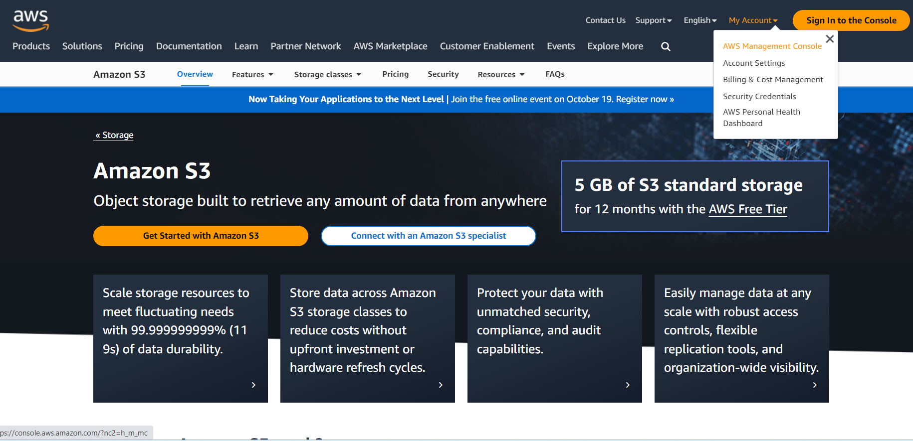
- Locate and access the S3 service and create a new bucket.
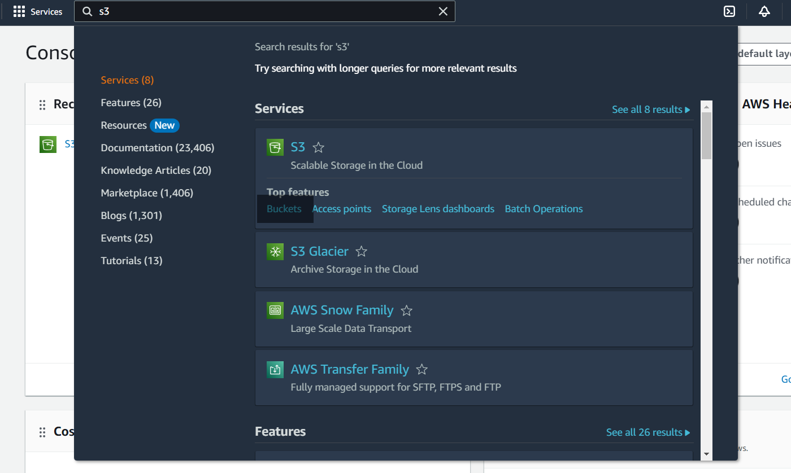
- Check "ACLs enabled" under Object Ownership.
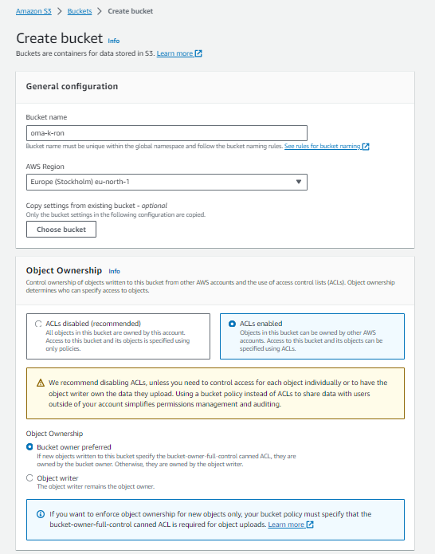
- Uncheck "Block all public access" and acknowledge the requirement for public access to static files.
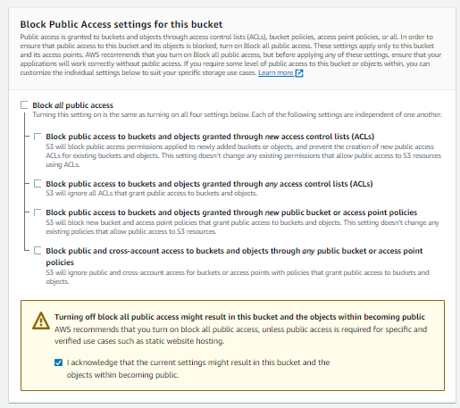
- Configure the bucket settings as follows:
- Enable static website hosting under Properties.
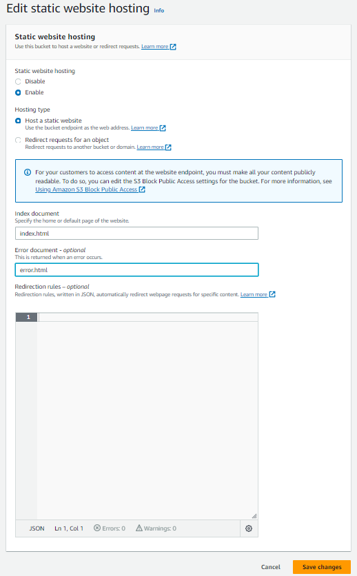
- Copy the provided code into the CORS section under Permissions:
```
[
    {
        "AllowedHeaders": [
            "Authorization"
        ],
        "AllowedMethods": [
            "GET"
        ],
        "AllowedOrigins": [
            "*"
        ],
        "ExposeHeaders": []
    }
]
```
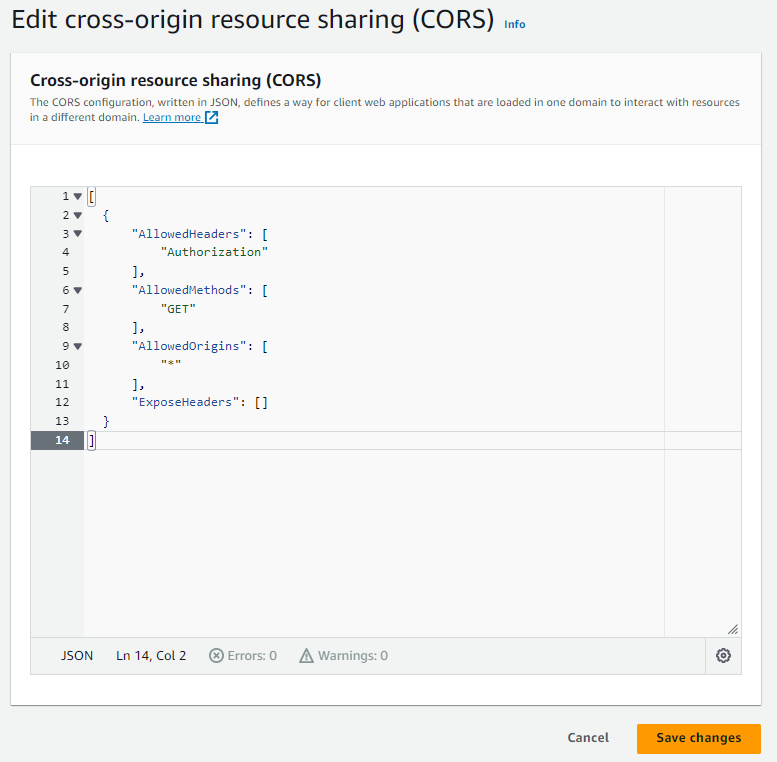
- Go to the "Policy generator" under Bucket policy.
- Select "S3 Bucket Policy" as the bucket type.
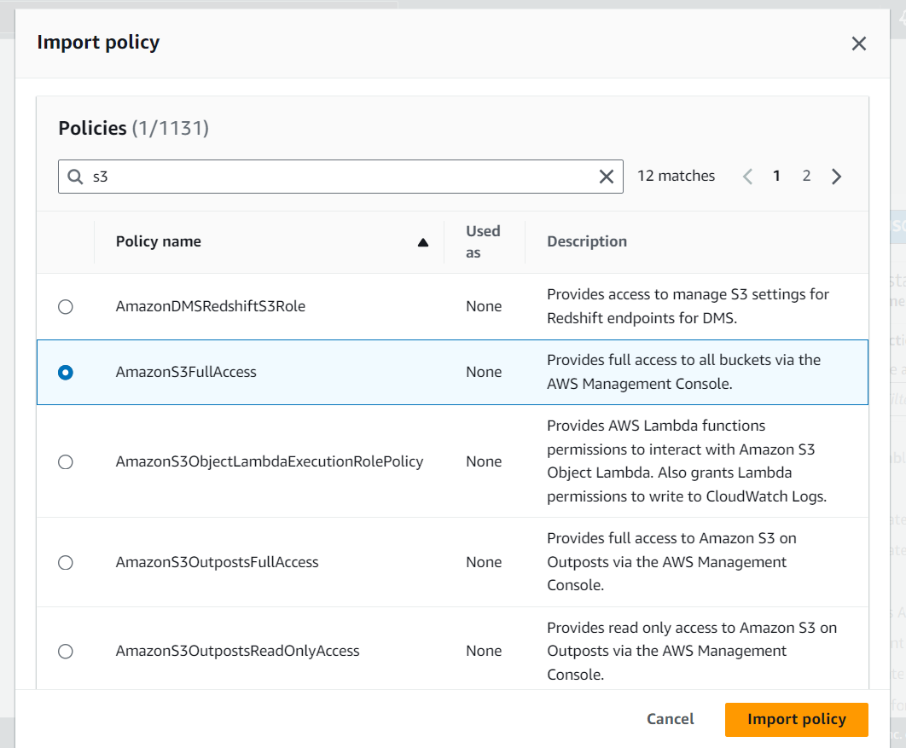
- Set the principal to "*" to allow access to all principles.
- Set the actions to "GetObject".
- Paste the ARN from the bucket settings tab.
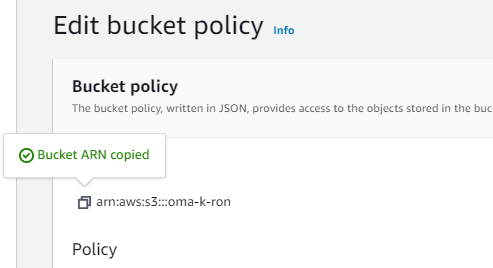
- Click "Add Statement" and then "Generate Policy".
- Copy the generated policy and paste it into the bucket policy editor. Append "/*" to the end of the resource key.
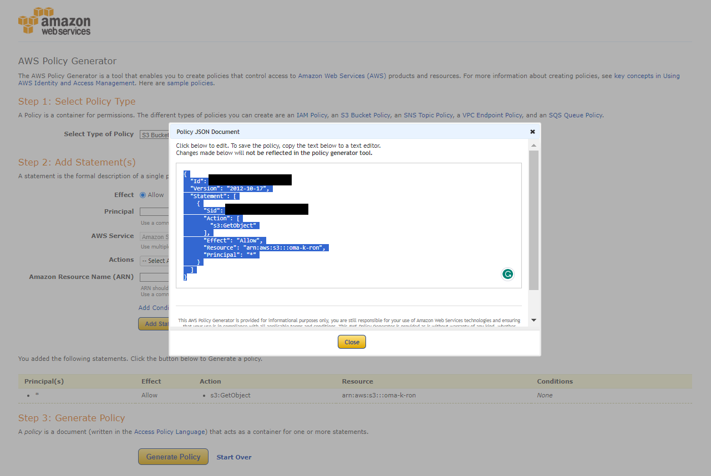
- Save the changes.

- Check the "List" checkbox for "Everyone (public access)" under the Access Control list (ACL).

- Create a user in the IAM (Identity and Access Management) to access the bucket.
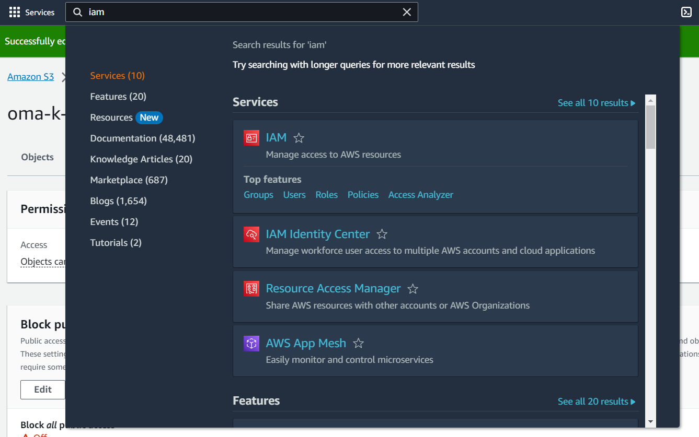
- In the IAM, go to "User Groups" in the left sidebar.
- Create a group for the user, assign an access policy that grants the group access to the S3 bucket, and assign the user to the group to enable access to all files.

### 10.4. Add Stripe to the project

To test the checkout process, Stripe provides some card numbers to trigger different behavior. They are as below:

| Card Number | Event |
| --- | --- |
| 4242 4242 4242 4242 | successful payment |
| 4000 0027 6000 3184 | 3DS authentication needed |
| 4000 0000 0000 0002 | failed payment |

Set up Stripe:
- Go to [Stripe](https://stripe.com/en-de) website and create an account
- Then go to the "Developers" tab and "API keys" and copy/paste the public and secret keys into your Heroky "config vars"
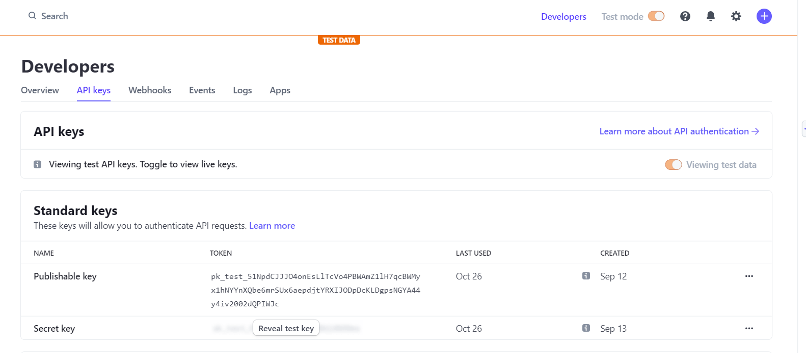
- Then to create a webhook:
  - go to the "Webhooks" tab and click "+ Add endpoint"
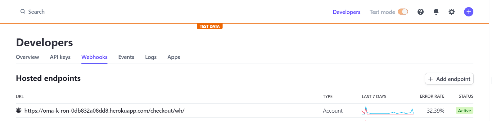
  - then select "Add an endpoint"
  - paste in the URL of the webhook (for this project the URL is "https://oma-k-ron-0db832a08dd8.herokuapp.com/checkout/wh/") and add a description (optional)
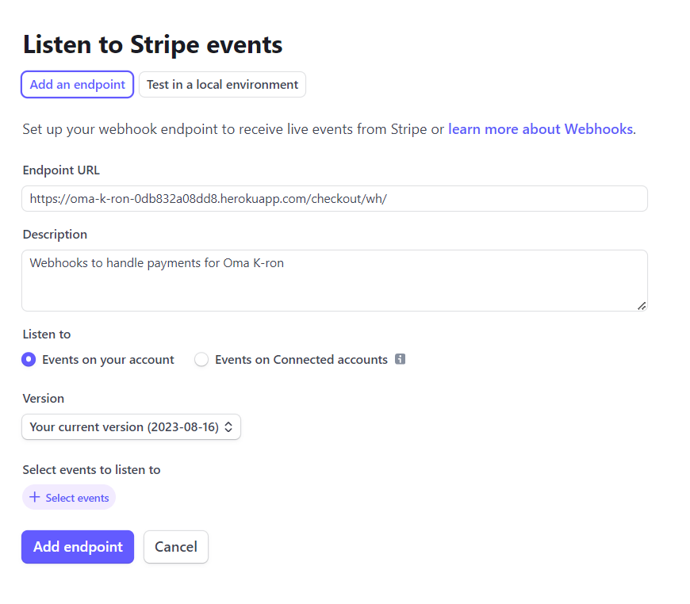
  - select all events, click "add events" and finally "add endpoint"
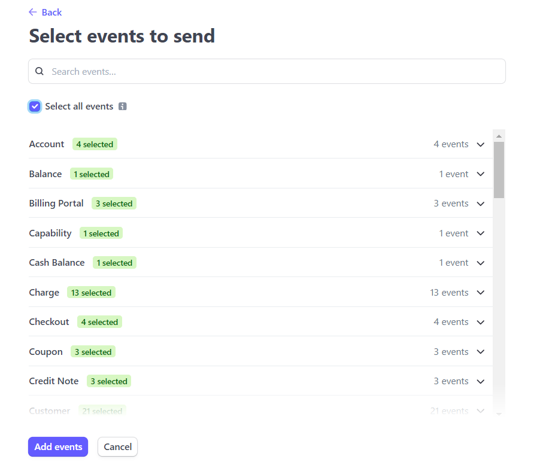
  - Then back to the "Webhooks" tab, click on the created webhook, click on "Reveal" under "Signing secret", copy the value, and paste it as a value of your webhook secret key in the Heroku app
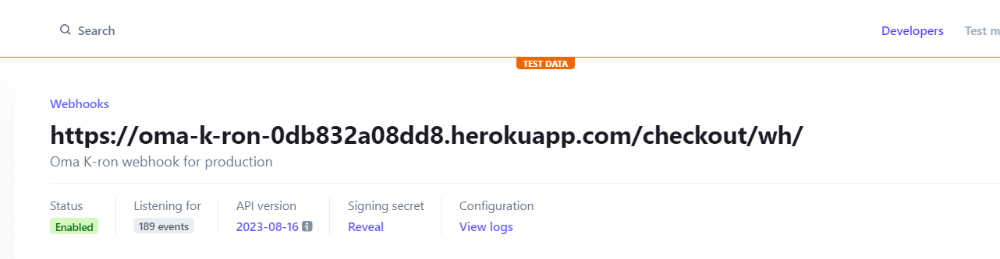

### 10.5. Deployment to Heroku

I used Heroku to deploy this project.

To deploy to Heroku:

1. In Code Anywhere CLI from the main directory, to create/update a requirements.txt file containing project dependencies, run

   `pip3 freeze --local > requirements.txt`

2. In Code Anywhere CLI from the main directory, to create a Procfile, run

   `echo web: gunicorn oma_k_ron.wsgi > Procfile`

3. Push the 2 new files to the GitHub repository

4. log in to Heroku, select 'Create New App', create a unique name for the app, and select your nearest region. Click 'Create App'

5. Navigate to 'settings', click reveal config vars, and input the following:

| Key | Value |
| ---: | :--- |
| ALLOWED_HOSTS | URL to the deployed site |
| AWS_ACCESS_KEY_ID | public AWS key |
| AWS_ACCESS_KEY_ID | secret AWS key |
| DATABASE_URL | elephantSQL_url |
| SECRET_KEY | django_secret_key |
| EMAIL_HOST_PASSWORD | password from your email address |
| EMAIL_HOST_USER | your email address |
| PORT | 8000 |
| SECRET_KEY | Django secret key |
| STRIPE_PUBLIC_KEY | stripe public key |
| STRIPE_SECRET_KEY | stripe secret key |
| STRIPE_WH_SECRET | your stripe webhook secret key |
| USE_AWS | True |

1. Navigate to the Deploy tab on the Heroku dashboard and select Github, search for your repository by name, and click 'connect'.
2. Click Deploy branch
3. Once the build is complete click on 'Open app' to launch the new app

[Back to the Table of Content](#1-table-of-content)

---

<div align="center">

## 11. Acknowledgment

</div>

This project has given me a lot of frustration because I would have loved to really explore and experiment with all the features implemented in the walkthrough project (using other tutorials and diving deeper into the documentation). But I have felt overwhelmed since the very start of the project and now that I am reaching the end of the project, I am very happy that I did not take any risk because I am just on time to submit a project which could still be a lot improved.

Whatever will be my overall result for the course, I am very happy and grateful for the 7 months I have spent learning some good fundamentals of Full Stack Software Development with [Code Institute](https://codeinstitute.net/de/). This was definitely one of my best decisions ever and I will only remember it in a very positive way.

I want to give a big thank you to their very supportive community and especially to 
- [Alan Bushell](https://github.com/Alan-Bushell) who always found the right word to keep me on track,
- [Jason Dunton](https://www.linkedin.com/in/jason-dunton/) from Code Institute tutoring for the huge help in fixing my Stripe webhooks. I have definitely spent over a week trying to fix that issue and Jason knew straight away where to look to identify clearly the origin of the problem. We could solve it within 20 minutes (and the longest part was to redeploy a few times on Heroku to test the solutions implemented)

[Back to the Table of Content](#1-table-of-content)

---

<div align="center">

**THANK YOU FOR READING THIS DOCUMENTATION**

<small>Feel free to get in touch if you have any questions or if you just want to share your thoughts on that project or something similar you are working on.</small>

</div>
