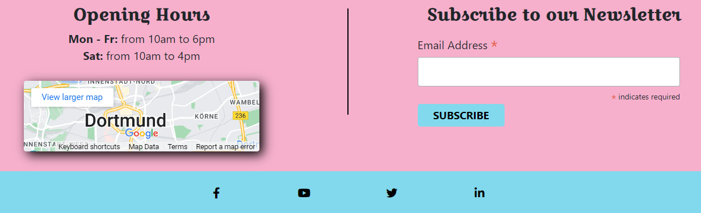

# Oma K-ron

This project aims to develop a website for the Oma K-ron company to help them have an online presence and promote their business.

Oma K-ron is a bakery company specialized in baking macarons. Macarons are small cakes which can be offered as presents, enjoyed for special event or even appreciate at anytime.

**- by Yannick Ferenczi -**

**[Live site](https://oma-k-ron-0db832a08dd8.herokuapp.com/) | [Repository](https://github.com/yannickferenczi/oma-k-ron-website)**

-- built with --

---

## Table of Content

---

## Business Model

---

## Marketing

---

## Agile Development

The project development has been managed with an agile project manager on GitHub. It is public [here](https://github.com/users/yannickferenczi/projects/18/views/1).

### The workflow

The workflow of the project has been broken down into small organized pieces to help realize the amount of work and help spread it over the given period. It organizes a hierarchy as below:

    
The full project (represented by the project manager)

    
The project manager has been a roadbook, leading the development of this project to its success, handling quite well the stress of such a challenge.

    
Milestones

    
5 Milestones were developed for this project..
    <ul>
    <li>The first Milestone [Project Preparation](https://github.com/yannickferenczi/oma-k-ron-website/milestone/1) was a guideline to prepare the project and set up the working environment.</li>
    <li>The second Milestone [Required Features](https://github.com/yannickferenczi/oma-k-ron-website/milestone/3) was there to list the minimum features to implement.</li>
    <li>The third Milestone [Required Marketing](https://github.com/yannickferenczi/oma-k-ron-website/milestone/4) was there to list the required marketing features.</li>
    <li>The fourth Milestone [Required Documentation](https://github.com/yannickferenczi/oma-k-ron-website/milestone/2) was there to list the required documentation.</li>
    <li>And finally a fifth Milestone [Extra Features](https://github.com/yannickferenczi/oma-k-ron-website/milestone/5) has been created to add some nice feature to have if the time allow it.</li>
    </ul>
    

    
EPICS

    
Milestones have been broken into Epics. They correspond to important achievements for the project such as "implementing an authentication system" or "implementing a checkout system". They were there to help me concentrate on concrete things to work on while developing the project. It gave some clear direction to take, knowing that they serve the general purpose of the project.

    
User Stories

    
User stories were backlog product items that could be done in quite a short time. So they could be contained within a sprint and therefore allow every sprint to have its number of achievements. Some user stories together usually fulfill an EPIC.

    
Tasks

    
Finally, tasks were defined within the user stories to remind the stakeholder what to develop. They were there to help define the user story, giving more precise things to work on.

### Labels

Labels have been created to quickly visualize the type of backlog product item and its priority. Below is a screenshot of the labels used for the project.

### The views of the project manager

The project manager contains 4 views. The three first have been very useful during the development. The fourth one is more of a nice overview of the efforts spread over time.

- The first view: Home

    The first view, called home, has been used during the development phase with the filter `is:open`. It was the first and the last view to look at on a working day. It helped to know what needed to be done, and what needed to be prioritized and help organized the upcoming days.

- The second view: Current sprint

    The second view was just nice to have when tasks were done and the goal of the current sprint was getting closer and closer. It gave a nice feeling of achievement while pushing the backlog product items to the "Ready" column and then to the "Deployed" column when they were respectively done and deployed to the live website.

- The third view: Sprints

    The third view was similar to the second one. Only it gave an overview of the full project and not just of the current sprint. It helped keep the deadline in mind and avoided wasting time on some "nice to have but cool to work on" features so the focus would mostly be on the right tasks.

- The fourth view: Roadmap

    The fourth view is just an overview of the three weeks of work that led to this project. It did not really bring help to the development of the project.

### The story points

Story points have been assigned to user stories only to be able to submit the project as much developed as possible and, of course, on time. It was clear that the final product would not be done in such a short time, especially because the implementation of the payment system seemd quite tricky to me and I would have like to dive more into it to really understand the whole mechanic. And as expected, I really struggle with this part of the project implementation being stock on this matter a pretty long time. This is why the story points of sprints 4 and 5 are so low.

My priority was as expected to develop a minimum viable product (MVP) that corresponds to the expected project from the assessment criteria of Code Institute. To achieve this expectation in such a short time, I did not find another way than to repeat the steps of the [Boutique-Ado](https://github.com/Code-Institute-Solutions/boutique_ado_v1) walkthrough project.

### The sprints

The project has been developed in 9 Sprints of 3 days.
Each sprint counts a certain amount of story points based on their Epics, User Stories, and tasks. They are as below:

| Sprints | Dates | Total Story Points |
| --- | :---: | :---: |
| Sprint 1 | 28/09 - 30/09 | 70 |
| Sprint 2 | 02/10 - 04/10 | 72 |
| Sprint 3 | 05/10 - 07/10 | 56 |
| Sprint 4 | 09/10 - 11/10 | 16 |
| Sprint 5 | 12/10 - 14/10 | 40 |
| Sprint 6 | 16/10 - 18/10 | 104 |
| Sprint 7 | 19/10 - 21/10 | 0 |
| Sprint 8 | 23/10 - 25/10 | 0 |
| Sprint 9 | 26/10 - 27/10 | 0 |

To conclude, I must admit that I have started this project with a very high level of stress because the whole checkout and payment system was quite involved. Creating this agile project manager was definitely helpfull to remind me everyday that the timeline was tight and that I should not lose focus. Nevertheless, it kept my stress at its highest level for the full implementation period and made me feel overwhelm every single day.

[Back to the Table of Content]()

---

## Features

This project is a full-stack web application using a cloud-based database (PostgreSQL) to record data and an online-payment provider (Stripe) to accept payments.

### Features currently available

- A branding with a logo, a name, and the colors of the company

- A navigation menu

- A call to action (CTA) on a Hero-image

- A footer with opening-hours, a newsletter subscription and links to social media

- A copyright

- A profile page

- A notification system

- An authentication system

- A shopping cart

- A checkout system

- Searching and filtering functionalities

### More features to implement

It would be nice to have the possibility to add a discount code within the checkout process so customers who have already purchase something are more likely to purchase again if they can benefit from a discount.

It would also be nice to have a "click and collect" option. I actually wanted to implement this feature at first and I have wasted a lot of time troubleshooting the checkout process so that I have decided to give up on that feature as it was not a must have for the assessement criteria.

---

## Technology Used

- Languages, Databases, Frameworks and libraries:

  - HTML5
  - CSS3
  - Javascript
  - Bootstrap 4.6.2
  - boto3 1.28.64
  - Python 3.9.17
  - Django 3.2.21
  - django-allauth 0.41.0
  - django-countries 7.5.1
  - django-crispy-forms 1.14.0
  - django-storages 1.14.2
  - dj-database-url 2.1.0
  - gunicorn 20.0.4
  - Pillow 10.0.1
  - PostgreSQL
  - psycopg2-binary 2.9.8
  - stripe 2.42.0
  - Markdown

- Other tools:

  - [Git](https://git-scm.com/) has been used for version control
  - [GitHub](https://github.com/) has been used to store the project code
  - [Code Anywhere](https://codeanywhere.com/) has been used as cloud ide
  - [Google Fonts](https://fonts.google.com/) has been used for the fonts
  - [Font Awesome](https://fontawesome.com/) has been used for the icons
  - [Pexels](https://www.pexels.com/) has been used to find free pictures
  - [Tiny PNG](https://tinypng.com/) has been used to further optimize the images for the site and reduce the file size
  - [ElephantSQL](https://customer.elephantsql.com/) has been used to store the database
  - [Heroku](https://www.heroku.com/) has been used to deploy the live website
  - [Google Chrome Dev Tools](https://developers.google.com/web/tools/chrome-devtools) has been used to inspect page elements, debug issues with the site & test responsiveness on different mockup devices.
  - [Markup Validation Service](https://validator.w3.org/) has been used to check the HTML code
  - [CSS Validation Service](https://jigsaw.w3.org/css-validator/) has been used to check the CSS code
  - [CI Python Linter](https://pep8ci.herokuapp.com/) has been used to check the Python code
  - [JSHint](https://jshint.com/) has been used to check the Javascript code
  - [PageSpeed Insights](https://pagespeed.web.dev/) has been used to check the speed of the website
  - [Wave](https://wave.webaim.org/) has been used to test the accessibility of the website
  - [Accessibility Checker](https://www.accessibilitychecker.org/) has been used to test the accessibility of the website
  - [Am I responsive](https://ui.dev/amiresponsive) has been used to create a mockup of responsiveness
  - [Shields.io](https://shields.io/) has been used to create badges within the README.md file
  - [Mailchimp](https://mailchimp.com/) has been used to collect email from potential customers
