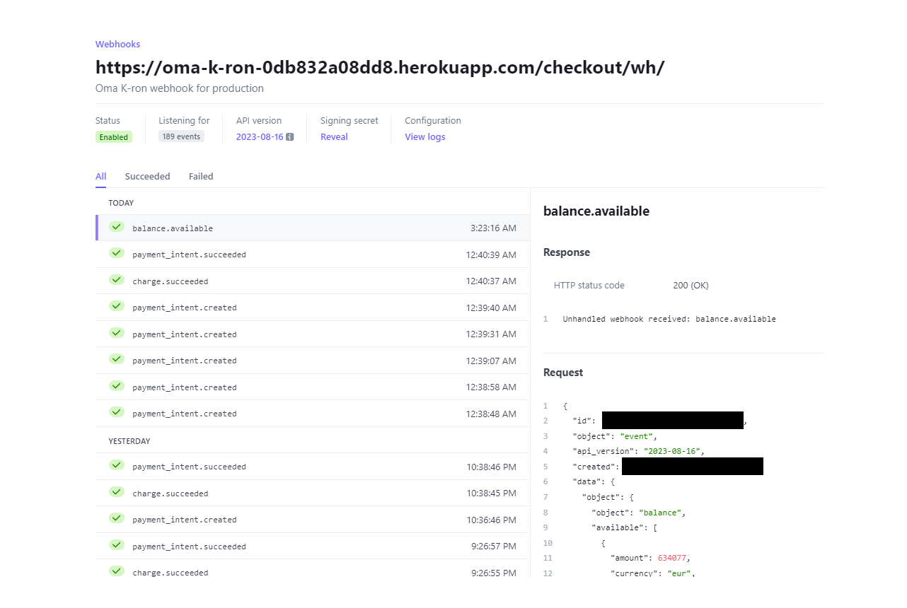

# Oma K-ron

***- TESTING DOCUMENTATION -***

## Table of Content

---

## Code Validation

### HTML

- w3c markup validator results for the landing page at the first verification :

Those errors were really frustrating as in the walkthrough project we exactly learned how to put li elements inside a nav element. A quick fix has been deployed to save the project from having errors. Unfortunately, the time left to submit the project did not allow a complete restructuration of the base.html file. Therefore the layout is not as good as expected. It was definitely a valuable lesson to run some testing already in the early development phase.

- w3c markup validator results for the landing page after fixing the errors :

- w3c markup validator results for the Product listing page :

- w3c markup validator results for the product detail page :

- w3c markup validator results for the shopping cart page :

- w3c markup validator results for the checkout page :

- w3c markup validator results for the checkout success page :

- w3c markup validator results for the blog listing page at the first verification :

Those errors were coming from the summernote widget used to create the blogs so to fix them, I had to manually modify the source code generated by the summernote widget. It fixed the issue but it is not a sustainable solution as it would need to be done for every new blog post created.

- w3c markup validator results for the blog listing page after fixing the errors :

- w3c markup validator results for the blog detail page :

- w3c markup validator results for the contact page :

- w3c markup validator results for the product management page :

- w3c markup validator results for the blog management page :

- w3c markup validator results for the profile page :

- w3c markup validator results for the privacy policy page :

### CSS

Result of the W3C CSS validation service for the base.css file :

Result of the W3C CSS validation service for the checkout.css file:

### JavaScript

Most of the javascript have been written within the template files because it was very short.

The javascript file is stripe_elements.js in the checkout app. The result of JSHint for that file is shown below:

- One undefined variable: stripe

    Stripe has been integrated to the base.hmtl template of the project as Stripe recommend it in their documentation. Therefore there is no need to explicitly import it in the script.js file.

### Python

Every Python file has been ran through the [CI Python Linter](https://pep8ci.herokuapp.com/) and for all of them the result was:
> All clear, no errors found

The flake8 module has been use on the project too to detect errors. Most of them have been fix.
The remaining ones are listed below:

---

## Lighthouse

The main pages of the website have been tested with the Lighthouse validator from Google Chrome.

The results are shown below.

### The landing page

    
Desktop

    

    
Mobile

    

### The Product listing page

    
Desktop

    

    
Mobile

    

### The product detail page

    
Desktop

    

    
Mobile

    

### The shopping cart page

    
Desktop

    

    
Mobile

    

### The checkout page

    
Desktop

    

    
Mobile

    

### The checkout success page

    
Desktop

    

    
Mobile

    

### The blog listing page

    
Desktop

    

    
Mobile

    

### The blog detail page

    
Desktop

    

    
Mobile

    

### The contact page

    
Desktop

    

    
Mobile

    

### The product management page

    
Desktop

    

    
Mobile

    

### The blog management page

    
Desktop

    

    
Mobile

    

### The profile page

    
Desktop

    

    
Mobile

    

### The privacy policy page

    
Desktop

    

    
Mobile

    

---

## Manual Testing

Main Navigation Menu

- Browser compatibility and responsiveness testing:

|  | chrome-desktop | chrome-mobile | safari-desktop | safari-mobile | firefox-desktop | firefox-mobile |
| :--- | :---: | :---: | :---: | :---: | :---: | :---: |
| Clicking on the logo leads to the home page |
| Search bar returns relevant products when finding some |
| Search bar returns a response with no products when finding no match |
| Search bar returns an error message when nothing was typed |
| My account icon opens a dropdown menu |
| The account dropdown menu display different content if users are logged in or not |
| The account dropdown menu display management options for product and blog if logged in users are superuser |
| The account dropdown menu does not display management options for product and blog if logged in users are not superuser |
| The product management option of the account dropdown leads to a form to add a product |
| The blog management option of the account dropdown leads to a form to add a post |
| The my profile option of the account dropdown leads to the users profile |
| The register option of the account dropdown leads to the sign up page |
| The login option of the account dropdown leads to the sign in page |
| The logout option of the account dropdown leads to the sign out confirmation page |
| The cart icon leads to the shopping cart page |
| The cart icon displays the amount of the shopping cart |
| The cart icon displays the number of items in the shopping cart |
| Clicking on "ALL PRODUCTS" opens a dropdown menu |
| Clicking on the "by price" option of the "ALL PRODUCTS" dropdown menu leads to a list of all products ordered by price ascending |
| Clicking on the "by style" option of the "ALL PRODUCTS" dropdown menu leads to a list of all macarons grouped by style |
| Clicking on the "all products" option of the "ALL PRODUCTS" dropdown menu leads to a list of all products |
| Clicking on "OUR MACARONS" opens a dropdown menu |
| Clicking on the "the singles" option of the "OUR MACARONS" dropdown menu leads to a list of all single macarons |
| Clicking on the "the boxes" option of the "OUR MACARONS" dropdown menu leads to a list of all boxes of macarons |
| Clicking on the "the celebrations" option of the "OUR MACARONS" dropdown menu leads to a list of all celebration cakes |
| Clicking on the "all macarons" option of the "OUR MACARONS" dropdown menu leads to a list of all macaron products |
| Clicking on "OUR EVENTS" opens a dropdown menu |
| Clicking on the "visit our factory" option of the "OUR EVENTS" dropdown menu leads to a list of all visit events |
| Clicking on the "learn how to bake" option of the "OUR EVENTS" dropdown menu leads to a list of all baking course events |
| Clicking on the "all events" option of the "OUR EVENTS" dropdown menu leads to a list of all event products |
| Clicking on "OUR BLOG" leads to the list of posts page |
| Clicking on "CONTACT US" leads to the contact page |
| Any option of the main navigation menu is highlighted when hovered on or active |

---

Main Footer

- Browser compatibility and responsiveness testing:

|  | chrome-desktop | chrome-mobile | safari-desktop | safari-mobile | firefox-desktop | firefox-mobile |
| :--- | :---: | :---: | :---: | :---: | :---: | :---: |
| The main footer displays the opening hours |
| The main footer displays a map with Oma K-ron's location |
| The map of the main footer opens googlemaps in a separate tab |
| The main footer displays a form to subscribe to the newsletter |
| The newsletter subscription form only accept valid email addresses |
| The newsletter subscription form has a submit button matching in style and color with the other buttons of the website |
| The main footer displays a link to facebook |
| The link to facebook opens the facebook business page of Oma K-ron in a separate tab |
| The main footer displays a link to the privacy policy |
| The link to privacy policy leads to an internal page |
| The main footer displays a copyright |

---

Authentication System

- Browser compatibility and responsiveness testing:

|  | chrome-desktop | chrome-mobile | safari-desktop | safari-mobile | firefox-desktop | firefox-mobile |
| :--- | :---: | :---: | :---: | :---: | :---: | :---: |
| The "sign up" page displays a form and a submit button |
| The "sign up" form only accept valid data |
| The "sign up" page displays a non-broken link to the "sign in" page |
| The "sign in" page displays a form and a submit button |
| The "sign in" form only accept valid data |
| The "sign in" page displays a non-broken link to the "sign up" page |
| The "sign in" page displays a non-broken link to the "password reset" page |
| The "password reset" page displays a form and a submit button |
| The "password reset" form only accept valid data |
| On the "password reset" form submition, users are redirected to a confirmation page ("Password Reset") |
| On the "password reset" form submition, users receive an email to reset their password |
| The link of the password reset email leads to a "change password" page |
| The "change password" page displays a form and a submit button |
| The "change password" form only accept valid data |
| Clicking on the reset password button leads to a confirmation page |
| On the "sign up" form submition, users are redirected to a "confirm email" page |
| On the "sign up" form submition, users receive an email to confirm their email address |
| The link of the confirmation email leads to a "confirm E-mail Address" page |
| The "confirm E-mail Address" page displays the user's email address and a confirm button |
| Clicking on the confirm button leads to the "sign in" page |
| On the "sign in" form submition, users are redirected to the home page |

---

Purchase and Checkout System

- Browser compatibility and responsiveness testing:

|  | chrome-desktop | chrome-mobile | safari-desktop | safari-mobile | firefox-desktop | firefox-mobile |
| :--- | :---: | :---: | :---: | :---: | :---: | :---: |
| Clicking on the picture of a product leads to the product detail page |
| Clicking on the plus button increment the quantity by 1 |
| Clicking on the minus button decrement the quantity by 1 |
| Clicking on the "add to cart" button add the product to the shopping cart with the quantity matching what the product detail page displayed |
| Clicking on the "keep shopping" button from the product detail page leads back to the list of all products |
| When adding product to the shopping cart, the price and quantity displayed with the shopping cart icon render accordingly |
| From the product listing page, the back to top button takes the user smoothly back to the top of the page |
| Adding the same product again does not add a new line to the shopping cart |
| Adding the same product again increment the quantity of the item already in the shopping cart |
| Using the plus and minus button from the shopping cart modify the right item's quantity accordingly |
| From the shopping cart, modifying the quantity of an item until 0 remove the item from the shopping cart |
| If the shopping cart only contains events, the delivery costs are equal to 0 € |
| If the shopping cart only contains macarons or boxes but no tower, the delivery costs are equal to 10 € |
| If the shopping cart contains at least one tower, the delivery costs are equal to 25 € |
| Clicking on the picture of a product from the shopping cart leads back to the product detail page |
| Clicking on the "keep shopping" button from the shopping cart leads back to the list of all products |
| Clicking on the "secure checkout" button from the shopping cart leads to the checkout page |
| The checkout page displays a summary of the order and a form to fill in the delivery information |
| If the form is not valid, the checkout does not happen |
| Clicking the "adjust cart" from the checkout page leads back to the shopping cart |
| Clicking the "complete order" button from the checkout page with valid information display a "process in progress" overlay until the response from Stripe |
| If the payment does not happen, users are redirected to checkout page with the order still ready to be checked out and the delivery information already filled in |
| If the payment happens successfully, users are redirected to checkout success page with the order with a summary of the order information and a button to head back to the product listing page |
| Clicking the "head back to our selection of products" from the checkout success page leads back to the list of all products |
| If the payment happens successfully, users receive a confirmation email with some information regarding their order |
| If a user tries to reach the webhook url (because they kn ow it and type it in the browser) they encounter a 405 error (because the webhook does not allow get method) |
| If the shopping cart is empty, user cannot reach the checkout page |
| Only events with an upcoming date are displayed in the products listing |
| Events are listed in the order of their date_of_event |

The checkout success page is not protected but it should not happen that someone can reach one checkout success were they are not allowed as they would need to provide the order number which is a unique random string of 32 characters.

Here is a Screenshot of a list of successful webhook for this project:

---

Product Management System

- Browser compatibility and responsiveness testing:

|  | chrome-desktop | chrome-mobile | safari-desktop | safari-mobile | firefox-desktop | firefox-mobile |
| :--- | :---: | :---: | :---: | :---: | :---: | :---: |
| If an anonymous user tries to reach the page to add a new product they will be redirected to the login page |
| If other logged in users than superuser try to reach the page to add a new product they will get an error message and be redirected to the landing page |
| If an anonymous user tries to reach the page to modify an existing product they will be redirected to the login page |
| If other logged in users than superuser try to reach the page to modify an existing product they will get an error message and be redirected to the landing page |
| If an anonymous user tries to reach the page to delete an existing product they will be redirected to the login page |
| If other logged in users than superuser try to reach the page to delete an existing product they will get an error message and be redirected to the landing page |
| If a superuser tries to submit an invalid add product form they are kindly asked to review their information and resubmit |
| If a superuser wants to add a product of type macarons, the fields date_of_event and duration are not displayed |
| If a superuser wants to add a product of type macaron, the fields style and flavour are displayed |
| If a superuser wants to add a product of type event, the fields date_of_event and duration are displayed |
| If a superuser wants to add a product of type macarons, the fields style and flavour are not displayed |
| Submiting a valid add product form redirect the superuser to the product detail page of the added product |
| If no superusers are logged in the edit and delete buttons are not displayed on the products listing page |
| If no superusers are logged in the edit and delete buttons are not displayed on the product detail page |
| If superusers click on the edit button of a particular product they are led to the edit product page |
| The form of the edit product page of is already filled in with the product information |
| The form cannot be submitted with invalid information |
| Clicking on the "cancel" button of the edit product form leads back to the all products listing page |
| Clicking on the "update product" submit the form and leads back to the product detail page |
| Clicking on the "delete" button of a particular product leads to a page to confirm before deletion |
| Clicking on the "cancel" button of the delete product page leads back to the all products listing page |
| Clicking on the "delete product" button of the delete product page permanently delete the product from the database |
| Clicking on the "delete product" button of the delete product page redirect superusers to the all products listing page |

---

Blog Management System

- Browser compatibility and responsiveness testing:

|  | chrome-desktop | chrome-mobile | safari-desktop | safari-mobile | firefox-desktop | firefox-mobile |
| :--- | :---: | :---: | :---: | :---: | :---: | :---: |
| If an anonymous user tries to reach the page to add a new blog post they will be redirected to the login page |
| If other logged in users than superuser try to reach the page to add a new blog post they will be redirected to an "error 403 - FORBIDDEN" page |
| If an anonymous user tries to reach the page to modify an existing blog they will be redirected to the login page |
| If other logged in users than superuser try to reach the page to modify an existing blog they will be redirected to an "error 403 - FORBIDDEN" page |
| If an anonymous user tries to reach the page to delete an existing blog they will be redirected to the login page |
| If other logged in users than superuser try to reach the page to delete an existing blog they will be redirected to an "error 403 - FORBIDDEN" page |
| If a superuser tries to submit an invalid add blog form they are kindly asked to review their information and resubmit |
| Submiting a valid add blog form redirect the superuser to the blog detail page of the added blog |
| If no superusers are logged in the edit and delete buttons are not displayed on the blog listing page |
| If superusers click on the edit button of a particular blog they are led to the edit blog page |
| The form of the edit blog page of is already filled in with the blog information |
| The form cannot be submitted with invalid information |
| The blog listing page only displays blog post which have the published checkbox ticked |
| The latest updated blogs appears at first |
| Clicking on the "cancel" button of the edit blog form leads back to the all blog listing page |
| Clicking on the "update post" submit the form and leads back to the all blog listing page |
| Clicking on the "delete" button of a particular blog leads to a page to confirm before deletion |
| Clicking on the "cancel" button of the delete blog page leads back to the all blog listing page |
| Clicking on the "delete post" button of the delete blog page permanently delete the blog from the database |
| Clicking on the "delete post" button of the delete blog page redirect superusers to the all blog listing page |

---

Notification System

- Browser compatibility and responsiveness testing:

|  | chrome-desktop | chrome-mobile | safari-desktop | safari-mobile | firefox-desktop | firefox-mobile |
| :--- | :---: | :---: | :---: | :---: | :---: | :---: |
| A new post has been successfully added to the database - success message |
| A blog post has been successfully updated - success message |
| A blog post has been successfully deleted - success message |
| An item has been added to the cart or its quantity has been updated - success message |
| The quantity of an item has been updated from the shopping cart(or removed if null) - success message |
| Payment cannot be processed - error message |
| Checkout form invalid - error message |
| Try to reach checkout page with empty shopping cart - error message |
| Stripe key missing on checkout process - warning message |
| Checkout form successfully submitted - success message |
| Contact form successfully submitted - success message |
| Contact form invalid - error message |
| Search button click without any search content - error message |
| Logged in but not superuser try to access the add product page - error message |
| New product successfully added to the database - success message |
| Submit an invalid add product form - error message |
| Logged in but not superuser try to access the edit product page - error message |
| Product successfully updated - success message |
| Submit an invalid update product form - error message |
| Superuser access an edit product page - info message |
| Logged in but not superuser try to access the delete product page - error message |
| Product successfully deleted - success message |
| Profile successfully updated - success message |
| User submit an invalid profile form - error message |
| User access an order summary from the profile page - info message |

---

Newsletter and contact form

- Browser compatibility and responsiveness testing:

|  | chrome-desktop | chrome-mobile | safari-desktop | safari-mobile | firefox-desktop | firefox-mobile |
| :--- | :---: | :---: | :---: | :---: | :---: | :---: |
| If the user is authenticated, the email field for the newsletter subscription is prepopulated with the user's email address |
| If the user tries to submit the newsletter subscription form with a non-valid email address format, errors are displayed |
| If the email address was already submitted for the newsletter subscription, the user is notified that the email address was already registered |
| When users fill in the newsletter subscription with a valid email address which was not submitted yet, they get a "thank you for subscribing!" |
| Users cannot submit an invalid contact form |
| When users submit a valid contact form, they are redirected to the all products listing page |
| When users submit a valid contact form, they receive a confirmation email |

---

## Bugs

Header too bright 

The website does not display well. It looks like the main header is brighter than the viewport. Then it creates a white band on the right of the screen which is not nice. I could not implement a fix for this issue. I could only fix it with the developer tool by removing some negative margin on a nav-link element. But I did not manage to do it within my code.

Unique slug exception not handled 

Submitting an add blog post form with a title matching exactly a title of another blog post redirect to an "error 500 - internal server error". This is due to the unique slug constraint on blog posts. The good thing is that it does not create a second blog post with the same slug or title. The bad thing is that it is really not user friendly and also really not explicit so the superuser creating the blog post might not understand what to do to solve the problem.

Webhook not working - phase 1 

I have struggled a lot while implementing the checkout process and especially to have the webhook working. After so much troubleshooting, I lost hope to solve it by myself and ask the tutoring to help me. That was definitely the right decision. It appeared that I named the payment_intent_payment_failed function a certain name and I missed name the function when calling it.

Webhook not working - phase 2 

The solution above was a good start but did not solve the issue on its own. Still with the help of tutoring, we find out that my email templates for the email confirmation were in the checkout app folder instead of being in the template folder of the same app. That fixed the problem and made up my mind to carry on through the hard time.

JS file from MailChimp does not load (error 404) 

For some reasons, the file (//s3.amazonaws.com/downloads.mailchimp.com/js/mc-validate.js) from MailChimp for the newsletter fail to load. I looked for a solution on the internet but I did not find anything relevant. Only one solution I found was to copy the content of that link and add it to a javascript file on the project. I have noticed that the url started with // so I the https: in front of it to fix the problem.

Return to the [README.md](README.md) file
