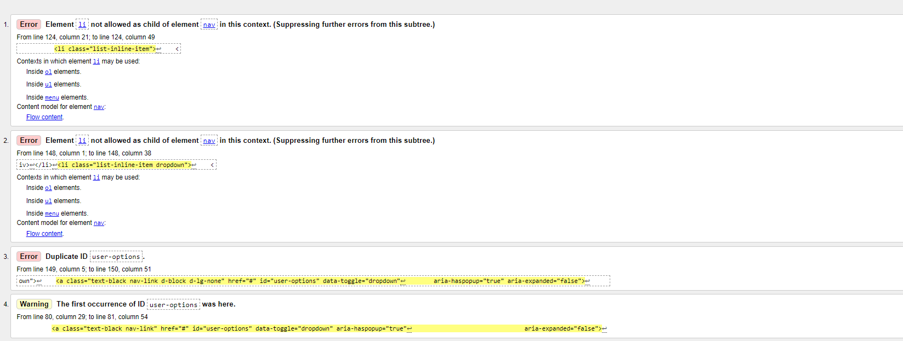
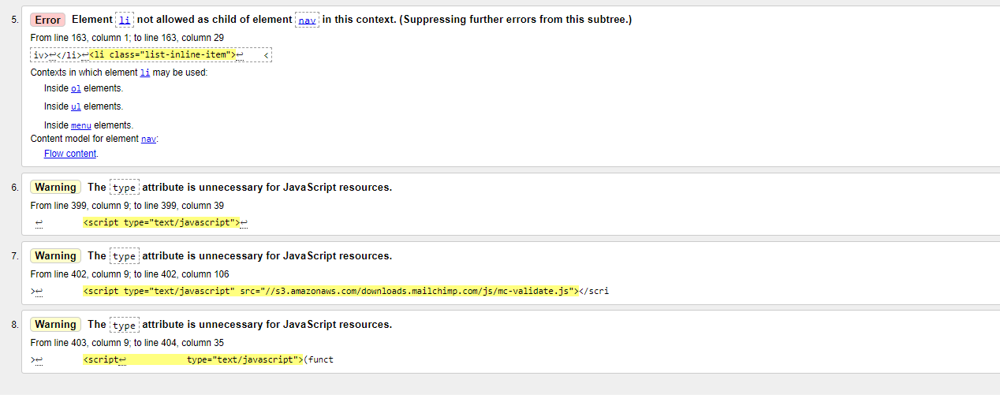

# Oma K-ron

***- TESTING DOCUMENTATION -***

## Table of Content

---

## Code Validation

### HTML

- w3c markup validator results for the landing page at the first verification :

- w3c markup validator results for the About page:

- w3c markup validator results for the personal dashboard:

- w3c markup validator results for the contact page:

- w3c markup validator results for the offers:

- w3c markup validator results for the calendar:

- w3c markup validator results for the daily calendar:

