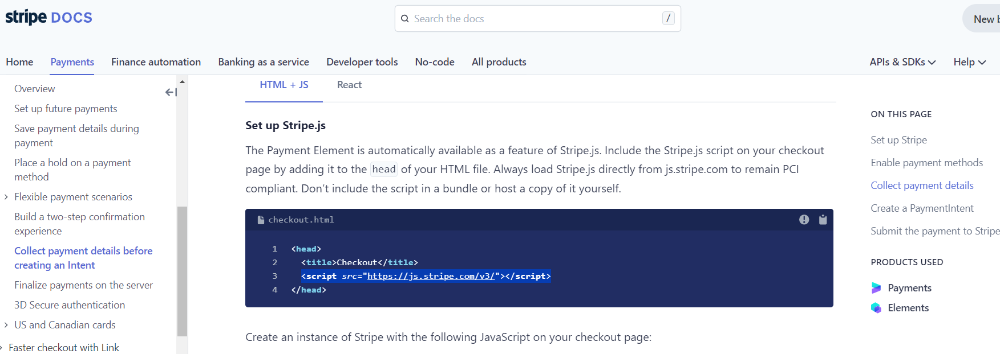

# Oma K-ron

***- TESTING DOCUMENTATION -***

## Table of Content

---

## Code Validation

### HTML

- w3c markup validator results for the landing page at the first verification :

Those errors were really frustrating as in the walkthrough project we exactly learned how to put li elements inside a nav element. A quick fix has been deployed to save the project from having errors. Unfortunately, the time left to submit the project did not allow a complete restructuration of the base.html file. Therefore the layout is not as good as expected. It was definitely a valuable lesson to run some testing already in the early development phase.

- w3c markup validator results for the landing page after fixing the errors :

- w3c markup validator results for the Product listing page:

- w3c markup validator results for the product detail page:

- w3c markup validator results for the shopping cart page:

- w3c markup validator results for the checkout page:

- w3c markup validator results for the checkout success page:

- w3c markup validator results for the blog listing page at the first verification :

Those errors were coming from the summernote widget used to create the blogs so to fix them, I had to manually modify the source code generated by the summernote widget. It fixed the issue but it is not a sustainable solution as it would need to be done for every new blog post created.

- w3c markup validator results for the blog listing page after fixing the errors :

- w3c markup validator results for the blog detail page:

- w3c markup validator results for the contact page:

- w3c markup validator results for the product management page:

- w3c markup validator results for the blog management page:

- w3c markup validator results for the profile page:

- w3c markup validator results for the privacy policy page:

### CSS

Result of the W3C CSS validation service for the base.css file:

Result of the W3C CSS validation service for the checkout.css file:

### JavaScript

Most of the javascript have been written within the template files because it was very short.

The javascript file is stripe_elements.js in the checkout app. The result of JSHint for that file is shown below:

- One undefined variable: stripe

    Stripe has been integrated to the base.hmtl template of the project as Stripe recommend it in their documentation. Therefore there is no need to explicitly import it in the script.js file.

### Python

Every Python file has been ran through the [CI Python Linter](https://pep8ci.herokuapp.com/) and for all of them the result was:
> All clear, no errors found

The flake8 module has been use on the project too to detect errors. Most of them have been fix.
The remaining ones are listed below:

---

## Lighthouse

The main pages of the website have been tested with the Lighthouse validator from Google Chrome.

The results are shown below.

### The landing page

    
Desktop

    

    
Mobile

    

### The Product listing page

    
Desktop

    

    
Mobile

    

### The product detail page

    
Desktop

    

    
Mobile

    

### The shopping cart page

    
Desktop

    

    
Mobile

    

### The checkout page

    
Desktop

    

    
Mobile

    

### The checkout success page

    
Desktop

    

    
Mobile

    

### The blog listing page

    
Desktop

    

    
Mobile

    

### The blog detail page

    
Desktop

    

    
Mobile

    

### The contact page

    
Desktop

    

    
Mobile

    

### The product management page

    
Desktop

    

    
Mobile

    

### The blog management page

    
Desktop

    

    
Mobile

    

### The profile page

    
Desktop

    

    
Mobile

    

### The privacy policy page

    
Desktop

    

    
Mobile

    

